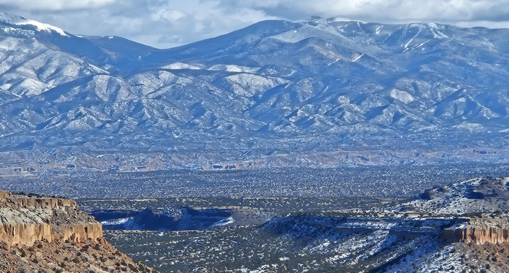

----------
## Table of contents
1. [New Mexico](#New Mexico)
    1. [Carlsbad Caverns](#Carlsbad Caverns)
    2. [Los Alamos & Santa Fe](#LASF)
2. [Maine](#Maine)
    1. [Baxter State Park](#Baxter State Park)
3. [Oregon](#Oregon)
    2. [Smith Rock State Park](#Smith Rock State Park)
4. [Texas](#Texas)
    1. [Big Bend National Park](#Big Bend National Park)
    2. [Guadalupe Mountains National Park](#Guadalupe Mountains National Park)

## New Mexico 
#### Carlsbad Caverns National Park 

Main room of the caverns. Photo taken by Dylan Schlichting, on December 14, 2020.

Entrance to the caverns. Photo taken by Dylan Schlichting, on December 14, 2020.

#### Los Alamos / Santa Fe 

Scenic overlook outside of Los Alamos. Photo taken by Ronnakrit, Rattanasriampaipong on Dec 03, 2023.

Scenic overlook at Bandolier National Monument. Photo taken by Dylan Schlichting on Dec 03, 2023.

Scenic overlook at Barranca Mesa. Photo taken by Dylan Schlichting on Dec 10, 2023.

## Maine
#### Baxter State Park 

 From the summit of Baxter Peak. Photo taken by Dylan Schlichting, on June 15, 2022.

## Oregon
#### Smith Rock State Park 

Scenic overlook in Smith Rock State Park. Photo taken by Dylan Schlichting, on December 13, 2022.

## Texas
#### Big Bend National Park 

From the summit of lost mine trail. Photo taken by Dylan Schlichting, on March 14, 2022.

Overlooking the Chisos Mountains from the summit of Emory Peak. Photo taken by Dylan Schlichting, on March 15, 2022.

#### Guadalupe Mountains National Park 

Overlooking El Capitan from the summit of Guadalupe Peak. Photo taken by Dylan Schlichting, on December 13, 2020.

