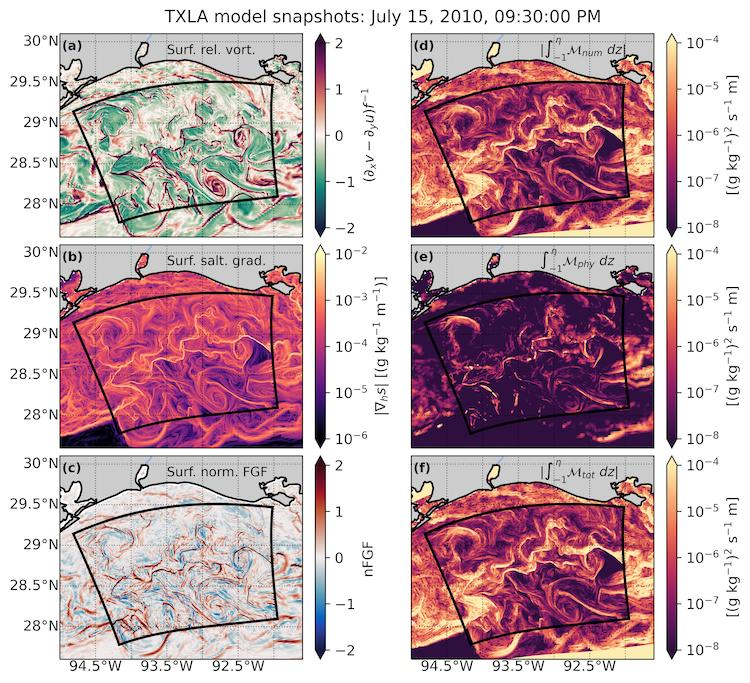
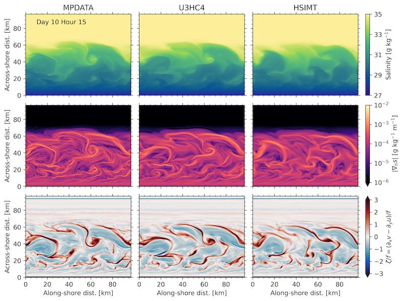

For most of my PhD, I've used Regional Ocean Modeling System ([ROMS](https://www.myroms.org/)) configured as part of the Coupled-Ocean-Atmosphere-Wave-Sediment Transport model ([COAWST](https://www.usgs.gov/centers/whcmsc/science/coawst-a-coupled-ocean-atmosphere-wave-sediment-transport-modeling-system)) to make numerical simulations river plumes and the the coastal ocean. ROMS has been a primary tool for the estuarine and coastal modeling community since the 1990s. Check out some of my projects below. Since I started at LANL, I've been learning to use MPAS-O and E3SM. I'll be posting an update on that when we have more simulations complete. The first two project images are linked to youtube videos! 

### High-resolution modeling of the Texas-Louisiana shelf

The TXLA model domain covers much of the northern Gulf of Mexico out to the outer continental slope. The current version of the model was developed by Dr. <a href="https://www.researchgate.net/profile/Daijiro-Kobashi">Daijiro Kobashi</a> to study submesoscale processes in the upper ocean for the SUNRISE project. The animation shows a two-way nested simulation that resolves submesoscale processes. Two-way nesting means that the coarse (parent) and fine (child) grids are allowed to exchange information across the open boundary. This can improve numerical model fidelity, however, it makes the simulations much more expensive to run. 

During summer, the regional diurnal land-sea breeze interacts with freshwater forcing from the Mississippi and Atchafalaya Rivers. These interactions cause a rich submesoscale eddy field with strong inertial currents to develop. This can be seen in plots of the surface relative vorticity $$(\partial_x v - \partial_y u) / f$$ as shown in subplot (a). Here, subscripts denote partial differentiation. These eddies have sharp, energetic fronts, which are marked by positive (red) values. The fronts have strong lateral salinity gradients ($$\nabla_h s$$) as shown in subplot (b). Subplot (c) shows a normalized version of the frontogenesis function (Hoskins, 1982), which tells us whether those salinity gradients are being sharpened by frontogenesis or destroyed by frontolysis. The fronts are thought to be hotspots for numerical mixing, a type of spurious mixing that can degrade the accuracy of numerical models. This is because the model must discretize very large changes in salinity over a small distances. The video shows that numerical mixing (subplot (d)) can greatly exceed the mixing based on physical conservation laws (subplot (e)) at shallow depths.

### Numerical mixing in an idealized coastal shelf model

One of the reasons we use idealized modeling is to build intuition. In the real ocean, many mixing processes occur simultaneously, spanning over eight orders of magnitude in space and time. An idealized model allows to study how individual processes affect the ocean state. For example, how fast the wind blows over the ocean surface. Here, we use an idealized coastal ocean model that develops a submesoscale eddy field to investigate how numerical mixing impacts the larger scale flow and salinity field.

The term submesoscale refers to ocean processes spanning approximately 100 m - 10 km in space, although they are better defined by their dynamical characteristics. Manifesting primarily as fronts, filaments, and eddies, submesoscales have $$\mathcal{O}(1)$$ Rossby numbers. A flow's Rossby number represents the ratio of the inertial force to the Coriolis force. Mathematically, this can be represented as $$Ro=U/fL \sim \zeta/f$$, where $$U$$ is a characteristic velocity scale, $$f$$ is the Coriolis parameter, and $$L$$ is a characteristic length scale. This is approximately equal to the relative vorticity $$\zeta/f$$. As the Rossby number approaches unity, it implies the flow is becoming more ageostrophic and three-dimensional. Classical approximations such as geostrophy, quasi-geostrophy, and semi-geostrophy break down as $$Ro$$ increases.

The video show the development of the eddy field after several days. An oscillatory along-shore wind stress is applied after four days to energize the fronts and increase numerical mixing. Each column shows a numerical simulation with a different tracer advection scheme. These are just different numerical methods for solving the advection term in the tracer conservation equation.

### Storm surge in estuaries
    
During my undergrad, I worked on the Sensing Storm Surge Project, which investigated storm surge in several Maine estuaries. I helped set up and maintain the citizen science network. The first picture is me prepping a mooring in Bass Harbor. The figure to the right is modified from Spicer et al. (2021), our Ocean and Coastal Management publication that shows observed surge in two estuaries. The figure demonstrates the effects of channel convergence on surge height.
