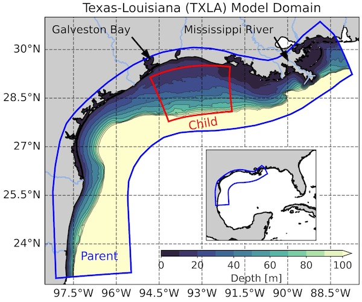
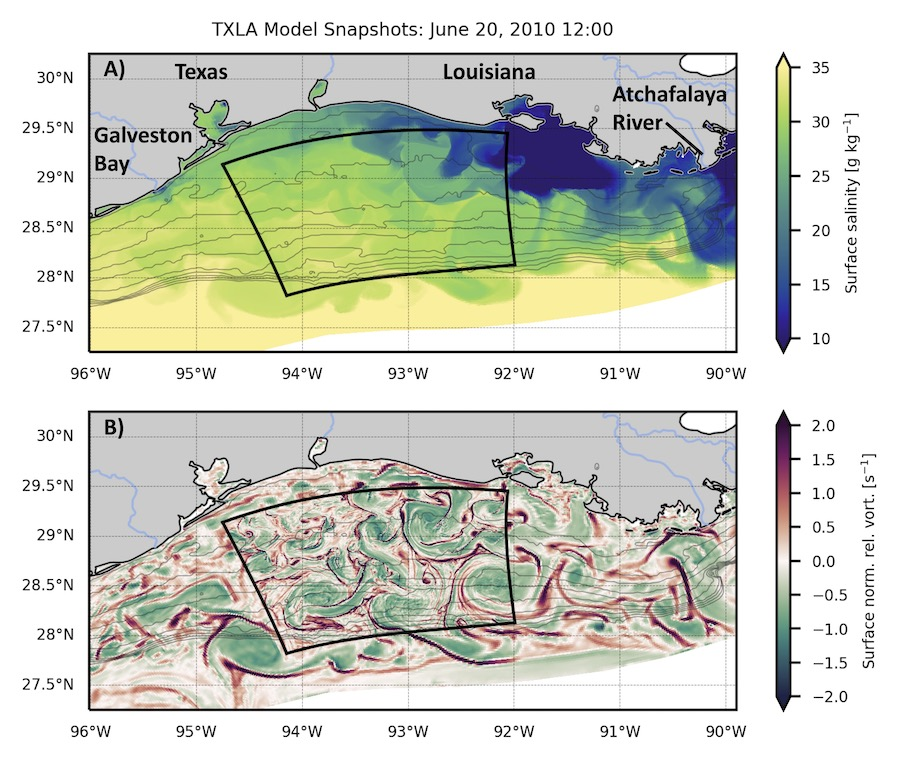
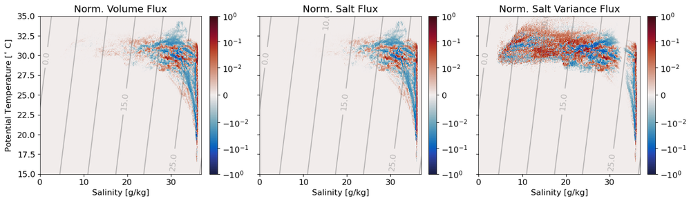
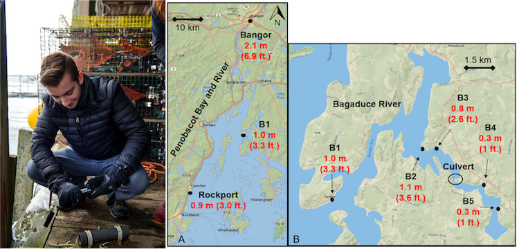

My research uses numerical simulations to characterize the dynamics of estuarine and coastal flows. There are two major projects I am working on right now: quantifying a special type of mixing in ocean models called numerical mixing, which arises from solving the momentum and tracer equations on a discrete grid, and expanding an analysis framework for analyzing tracer fluxes and mixing called total exchange flow (TEF) to the coastal ocean. I use the Regional Ocean Modeling System (ROMS) for my simulations, which has been a favorite tool in the modeling community for over 20 years. I am also associated with the NSF-NERC SUNRISE project, which aims to create a unified dynamical description of near-inertial motions, submesoscale processes, and their role on turbulent mixing.

  
  High resolution ocean modeling   

    

  The TXLA model domain covers the entire continental slope and is mainly used for investigations of shelf processes, which are heavily influenced by discharge from the Mississippi and Atchafalaya rivers. We are using a high resolution nested implementation of the TXLA model developed by <a href="https://www.researchgate.net/profile/Daijiro-Kobashi">Daijiro Kobashi</a> to study submesoscale processes, which are small scale processes that are characterized by strong currents, large vertical motions, and elevated mixing. The image below shows plots of the surface salinity and normalized vorticity fields. As youy can see, the nested grid does not differ that much from the native grid in terms of salinity, but the voriticty field resolves an entire swath of new processes!  
  

<!-- 

  Quantifying numerical mixing the in the TXLA model   

  <!--  -->

  <!-- Numerical mixing is the mixing generated by the discretization of advection schemes. We aim to quantify the numerical mixing in the TXLA model because it can be bigger than the physical (real) mixing resolved by the model. In the figure above,  the black box indicates the location of a two-way nested grid that has five times the native resolution of the model. Our goal is to compare mixing between the native grid and high resolution child grid using tracer variance budgets. Preliminary results suggest that numerical mixing is approximately halved for the child grid relative to the parent due to newly resolved processes.  

 -->

  
  Total Exchange Flow (TEF) in the coastal ocean   

    

  TEF was originally developed by Parker MacCready for looking at tracer fluxes and mixing for estuaries. TEF involves taking a control volume or transect, and binning corresponding tracer fluxes in a coordinate of your choosing. In the Gulf, the salinity is the primary tracer that controls the density structure close to the plume but temperature can become important when river input is low. The figure shown above is a temperature-salinity (TS) diagram of the total volume flux, salt flux, and salinity anomaly squared into and out of the nested grid integrated over the entire simulation. It is normalized by its maximum value so you can clearly see how complex the flow structure is if you don't average it. Note that the salinity anomaly squared flux spans a much larger salinity range because we remove the effects of the mean salinity to quantify the salinity anomaly. In the future we also plan to look at mixing in both salinity and temperature space!

  
  Copano Bay salinity dynamics   

    

  As an REU student, I worked on characterizing the salinity structure of Copano Bay, an inverse estuary on the Gulf Coast. The inverse circulation causes some interesting dynamics to occur. For example, plotting the normalized salinity difference versus the salinity gradient at the estuary mouth reveals just how weird the salinity structure is. this project is currently being worked on by <a href="Tianxiang Gao](https://ocean.tamu.edu/people/profiles/students/gaotianxiang.html">Tianxiang Gao</a>

  
  Storm surge in estuaries   

    
During my undergrad, I worked on the Sensing Storm Surge Project, which investigated storm surge in several Maine estuaries. I helped set up and maintain the citizen science network. The first picture is me prepping a mooring in Bass Harbor. The next figure is taken from our manuscript that shows observed surge in two estuaries, which demonstrates the effects of convergence on surge height.

