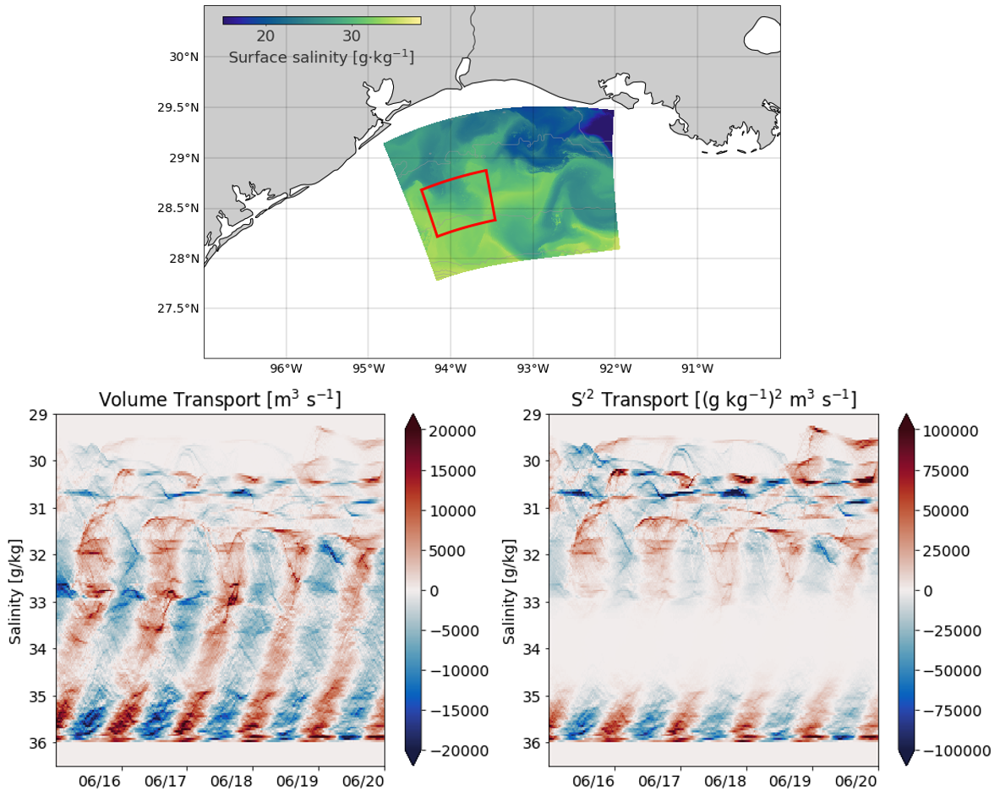

Most of my active projects are part of the NSF-NERC SUNRISE project, which aims to create a unified dynamical description of near-inertial motions, submesoscale processes, and their role on turbulent mixing.

### Quantifying numerical mixing in the TXLA model

Numerical mixing is the mixing generated by the discretization of advection schemes. We aim to quantify the numerical mixing in the TXLA model because it can be bigger than the physical (real) mixing resolved by the model. In the figure above,  the black box indicates the location of a two-way nested grid that has five times the native resolution of the model. Our goal is to compare mixing between the native grid and high resolution child grid using tracer variance budgets. Preliminary results suggest that numerical mixing is approximately halved for the child grid relative to the parent due to newly resolved processes.  

### Total Exchange Flow (TEF) in the Northern Gulf of Mexico
---

TEF was originally developed by Parker MacCready for looking at tracer fluxes and mixing for estuaries. TEF involves taking a control volume or transect, and binning corresponding tracer fluxes in a coordinate of your choosing. We use salinity coordinates for the Gulf because density differences are driven almost entirely by salinity. The top picture shows outputs from a nested grid of surface salinity from the TXLA model, with a control volume for TEF shown in the red box. The bottom picture shows the net volume and salinity variance transport  into and out of the box. You can see the strong inertial signal and these high-resolution filaments that develop. We hope to use TEF to quantify the different scales of mixing that occur over the TXLA shelf. 

### Copano Bay Salinity Structure
---

As an REU student, I worked on characterizing the bulk salinity structure of Copano Bay, an inverse estuary on the Gulf Coast. The inverse circulation causes some interesting dynamics to occur. For example, plotting the normalized salinity difference versus the salinity gradient at the estuary mouth reveals just how weird the salinity structure is. this project is currently being worked on by [Tianxiang Gao](https://ocean.tamu.edu/people/profiles/students/gaotianxiang.html).

### Estuarine Storm Surge
---
 
During my undergrad, I worked on the Sensing Storm Surge Project, which investigated storm surge in several Maine estuaries. I helped set up and maintain the citizen science network. The first picture is me prepping a mooring in Bass Harbor. The next figure is taken from our manuscript that shows observed surge in two estuaries, which demonstrates the effects of convergence on surge height. 

