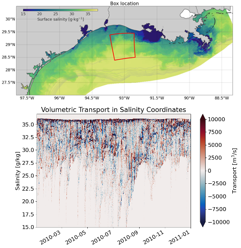
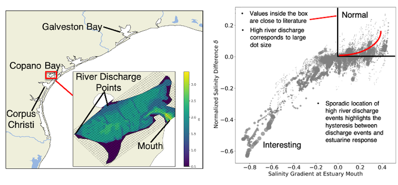

Most of my active projects are part of the NSF-NERC SUNRISE project, which aims to create a unified dynamical description of near-inertial motions, submesoscale processes, and their role on turbulent mixing.

### Total Exchange Flow in the Gulf of Mexico
---

We are actively developing a framework called Total Exchange Flow (TEF), which seeks to quantify ocean circulation in salinity coordinates. TEF was proposed by Parker MacCready for quantifying estuarine mixing in a seminal 2011 JPO paper. Using the divergence theorem, we are using TEF to quantify submesoscale mixing processes over the Texas-Louisiana Shelf. Pictured above is a histogram of a volumetric transport from TXLA model output in salinity coordinates. Just from this one picture you can see so how important transient forcing from the river plume is!

### Copano Bay Salinity Structure
---
As an REU student, I worked on characterizing the bulk salinity structure of Copano Bay, an inverse estuary on the Gulf Coast. The inverse circulation causes some interesting dynamics to occur. For example, plotting the normalized salinity difference versus the salinity gradient at the estuary mouth reveals just how weird the salinity structure is. this project is currently being worked on by [Tianxiang Gao](https://ocean.tamu.edu/people/profiles/students/gaotianxiang.html).

### Estuarine Storm Surge
---
During my undergrad, I worked on the Sensing Storm Surge Project, which investigated storm surge in several Maine estuaries using a citizen science network. I helped set up and maintain the citizen science network. Below is a plot of the the observed surge in two estuaries, one of which demonstrates the effects of convergence on surge height. 

